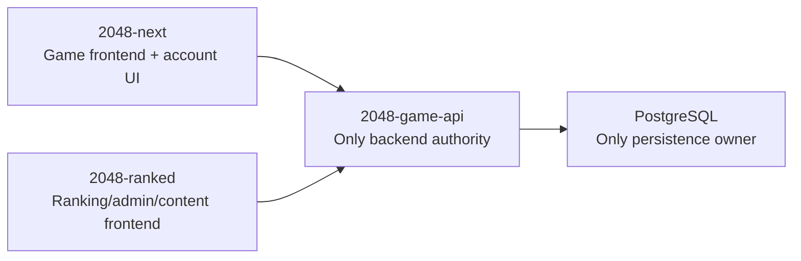

# Architecture Realignment Design

## Target Architecture

The target system has one backend and two frontends.

- `2048-game-api` owns every authoritative API, token, verification rule, and database write.
- `2048-next` owns the playable 2048 browser experience, including login/register/account screens, but it treats account state and game data as remote API state.
- `2048-ranked` owns leaderboard, ranking, management, and content UI, but it treats users, boards, entries, invites, permissions, posts, audit logs, game records, replay data, and ranked sessions as remote API state.

The permanent runtime shape is:

## Boundary Contract

`2048-game-api` must expose stable `/api/*` routes for both frontends. Route categories are:

- Account: login, captcha, nickname checks, registration, password reset/change, current user, public user lookup, token refresh if still required by existing clients.
- Game data: records, replay objects, replay version, leaderboard, leaderboard modes, record restore.
- Ranked state: ranked session start, ranked checkpoints, ranked session finalization.
- Special modes: stone-2k, relay, rescue offers.
- Ranked product content: boards, entries, players, posts, invites, permissions, audit logs, admin review/moderation operations.

Frontends may keep browser/session storage for UX, such as auth tokens, current-user display data, local history, optimistic form state, and retry queues. Frontends must not sign or verify authoritative tokens, hash or verify passwords, connect to databases, define migrations, verify replays, derive authoritative leaderboard placement, or mutate persisted ranking/admin content directly.

## Current Drift To Retire

`2048-next` drift:

- `scripts/dev-local.mjs` defaults the API repo to `../2048-ranked`.
- `src/services/api-client.ts`, `js/api_shared_utils.js`, and ranked-session bootstrap code already provide client-side API boundaries, but they must consistently target `2048-game-api`.

`2048-game-api` drift:

- `src/index.ts` still contains Worker account routes and legacy D1 schema logic.
- `src/server/*` is the target self-hosted Hono/Postgres backend, but it does not yet expose the full account and ranked-content contract.
- `migrations/postgres/0001_trusted_ranked_schema.sql` has game-data tables but not the complete account/ranked-content schema.

`2048-ranked` drift:

- `src/server/game/*`, `src/app/api/game/[[...path]]/route.ts`, and `src/server/replay_verify.ts` still own game backend behavior.
- `src/app/api/auth/token/route.ts`, `src/app/api/auth/refresh/route.ts`, `src/lib/auth/*`, and NextAuth config still own account/session authority.
- `src/lib/db/*`, `drizzle/*`, `migrations/postgres/*`, and server actions under `src/app/_actions/*` still own database-backed ranked product state.

## Migration Stages

### Stage 1: Account Authority In `2048-game-api`

Move self-hosted account authority into `2048-game-api/src/server/*`.

Implementation shape:

- Add Postgres account migrations in `2048-game-api`.
- Port route semantics from `2048-game-api/src/index.ts` and the currently deployed ranked auth implementation.
- Keep token format compatible with current v2 tokens: `2048-auth-token` signature scope and existing `Authorization: Bearer` consumption.
- Define how the account master users table relates to existing `game_data.users_shadow`; the target is one backend-owned consistency boundary, not hidden cross-service sync.

Acceptance:

- `2048-game-api` self-hosted tests cover login, registration, nickname checks, password reset/change, `/api/me`, `/api/user/me`, `/api/user/:id`, and token refresh if retained.
- Frontends can authenticate only against `2048-game-api`.

### Stage 2: `2048-next` Uses Only `2048-game-api`

Point `2048-next` account, ranked-session, leaderboard, records, rescue, relay, and admin calls at `2048-game-api`.

Implementation shape:

- Change local dev default from `../2048-ranked` to `../2048-game-api/2048-game-api`.
- Keep UI screens intact; only change backend target and contract normalization.
- Add or update smoke tests around login/current-user, ranked-session start, record submit/history, and leaderboard load.

Acceptance:

- `npm run audit:service-boundary` passes.
- `npm run verify:prepush` passes or any unrelated pre-existing failure is documented with command output.
- No new same-origin backend implementation is added to `2048-next`.

### Stage 3: Game Backend Authority Leaves `2048-ranked`

Move `2048-ranked/src/server/game/*` behavior into `2048-game-api` or verify that equivalent `2048-game-api` routes already exist.

Implementation shape:

- Compare route behavior in `2048-ranked/src/server/game/app.ts` and `2048-game-api/src/server/app.ts`.
- Migrate missing health, replay storage, ranked session, leaderboard, records, relay, admin rescue, and auth compatibility behavior into `2048-game-api`.
- Replace `2048-ranked` `/api/game/*` local route handling with an API client/proxy shim during cutover.
- Remove the shim after production routing points `/api/*` game paths at `2048-game-api`.

Acceptance:

- `2048-ranked` no longer imports `src/server/game/*` from UI or route handlers.
- `2048-game-api` tests cover all game routes consumed by both frontends.
- Online `/api/health` and `/api/game/health` no longer report a `2048-ranked` commit as the backend source.

### Stage 4: Ranked Product Persistence Moves To `2048-game-api`

Move boards, entries, players, posts, invites, permissions, and audit persistence out of `2048-ranked`.

Implementation shape:

- Add `2048-game-api` Postgres migrations for ranked product content.
- Add API endpoints for public reads and admin writes used by `2048-ranked` pages and server actions.
- Convert `2048-ranked` DB-backed server components and actions to API calls.
- Keep SSR where useful by calling `2048-game-api` from server components, but do not import DB schema or database clients.

Acceptance:

- `2048-ranked` public board pages, hall-of-fame, monthly posts, admin boards, admin entries, review flows, invites, permissions, profile/submissions pages, and password/nickname flows run through API calls.
- `2048-ranked` does not require `DATABASE_URL` or Drizzle migrations to render frontend pages.
- `2048-game-api` owns audit writes for admin mutations.

### Stage 5: Cutover And Removal

Retire frontend-owned backend code after equivalent backend endpoints are live and verified.

Implementation shape:

- Freeze `2048-ranked` writes during a short maintenance window.
- Export and import ranked persistent data into `2048-game-api`.
- Run row-count, checksum, and high-value page/API spot checks.
- Switch production routing so game/account/ranked-content API traffic goes to `2048-game-api`.
- Remove `2048-ranked` local database config, migrations, DB scripts, token signing, password verification, game API route handlers, and direct DB imports.

Acceptance:

- `2048-ranked` build and smoke tests pass without local DB access.
- `2048-game-api` is the only production service with database credentials.
- Rollback can restore the previous deployed frontend and database snapshot if cutover validation fails.

## Data Migration Strategy

Use an additive backend-first migration.

1. Create target tables in `2048-game-api`.
2. Add read APIs before switching frontend reads.
3. Add write APIs with audit coverage before switching admin writes.
4. For `2048-ranked`, run a maintenance migration:
   - freeze admin/backend writes;
   - keep public read-only pages if low-risk;
   - export users, boards, players, entries, posts, invites, permissions, audit logs, and relevant game linkage data;
   - import into `2048-game-api`;
   - verify counts, uniqueness constraints, representative pages, and admin workflows;
   - switch frontend API base and production route mapping.

No dual-write period is planned unless cutover validation proves it is necessary. Dual-write would increase consistency risk and should remain a fallback, not the default design.

## Authentication And Sessions

`2048-game-api` signs authoritative tokens. Both frontends store and present those tokens.

`2048-ranked` may keep framework-level session conveniences only if they are derived from `2048-game-api` token validation and do not introduce independent password, token-signing, or database-backed identity authority. If that adds complexity, prefer a small ranked API client plus explicit token cookies/headers over retaining NextAuth as a parallel auth system.

## Deployment And Rollback

Deploy in backend-first order:

1. Deploy additive `2048-game-api` migrations and routes.
2. Deploy frontend changes that read from `2048-game-api` while compatibility shims still exist.
3. Migrate ranked content data during the approved maintenance window.
4. Switch production API routing.
5. Remove obsolete ranked backend/database code after production verification.

Rollback points:

- Before Stage 2: revert `2048-next` API target changes.
- Before Stage 3 cutover: keep ranked game API shim available.
- Before Stage 4 write switch: keep ranked admin writes frozen rather than partially resumed.
- After data migration but before deletion: restore previous ranked deployment and database snapshot if validation fails.

## Verification Matrix

`2048-game-api`:

- `npm run typecheck`
- `npm run test`
- `npm run test:node`
- targeted migration/import dry-run checks before production data migration

`2048-next`:

- `npm run audit:service-boundary`
- `npm run verify:prepush`
- targeted smoke tests for account, ranked-session, records, leaderboard, and admin rescue flows

`2048-ranked`:

- `npm run typecheck`
- `npm run lint`
- `npm run test`
- `npm run e2e` for public board and auth/admin paths when browser dependencies are available
- boundary scan proving no imports from local DB schema/client, token signing, password verification, or `src/server/game/*`

Cross-repo:

- production `/api/health` identifies `2048-game-api` as backend source;
- both frontends can log in with the same account token contract;
- both frontends can read account identity from `2048-game-api`;
- ranked/admin data mutations create audit records in `2048-game-api`.
