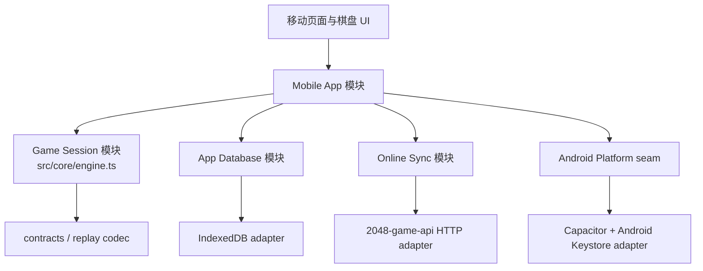

# Android App 技术设计

> 状态：用户已于 2026-07-23 明确批准规划与低保真线框；阶段 1、2.1、3.1、3.2 已完成，阶段 2 与 3 并行推进，尚未进入正式移动业务页面实现。

## 1. 设计结论

- 在 `2048-next` 同一仓库建立 `mobile/` 单入口应用、独立 Vite 配置和独立 `dist-app`，由 Capacitor 打包本地资源。
- 不封装线上网页，不复用 Web 页面、`GameManager`、Actuator、输入器或 legacy 脚本清单；现有 Web 继续独立运行。
- 直接加深现有 `src/core/engine.ts`，使它成为真正执行移动、合并、计分、确定性出块、撤回和回放记录的无 DOM 游戏模块；不建立第二套 App 专用规则引擎。
- App 关键本地数据使用新的 IndexedDB 数据库；数据量和查询规模不需要 SQLite。只有安全 Token、生命周期、状态栏、触觉、临时文件和系统分享进入窄 Android 适配层。
- App 直接调用唯一的 Node/PostgreSQL `2048-game-api` HTTPS 基址。所有权威账号、记录验证、排行榜名次、成就和删除账号逻辑仍在后端。
- 首版只实现已经确认的三个 2 的幂模式，不建设插件式路由、通用模式框架、后台 WorkManager 或云端未结束存档。

## 2. 仓库证据与硬门槛

- 当前 Web Vite 配置会复制整个 `js/` 目录并构建二十多个 HTML 入口，不能作为 App 构建输入：`vite.config.ts`。
- 当前 `createEngineSession().move()` 仍要求调用方先算出 `scoreAfterMerge` 和 `hasMovesAvailable`，且始终返回空移动明细；它不是完整引擎：`src/core/engine.ts`。
- 真正的棋盘遍历、合并、出块和成功移动后结算仍在 `js/core_game_manager_move_input_helpers_runtime.js`。
- 已有可复用的纯计算包括移动路径、合并规则、可移动性扫描、计分、撤回快照和回放编解码；应迁移运行现实到这些模块，而不是把 legacy 搬进 App。
- 当前仓库没有 Capacitor、Android 工程、SQLite、推送或崩溃 SDK。
- 现有 OpenAPI 与 Node 实现存在周期、历史筛选、刷新 Token 等漂移；联网页面开发前必须先修复契约。

以下是进入正式页面开发前的硬门槛：

1. 方向输入可由纯核心独立得到新棋盘、分数、出块、终局和动画 effects。
2. 三个首版模式的固定 seed + 动作序列与 Web 兼容路径、服务端 verifier 产出一致。
3. App 构建产物不包含 `playLegacyScripts`、`legacy-loader`、`home_standard_*bundle.js`、`js/game_manager.js` 或 Web 多页面 HTML。
4. 后端移动所需合同已冻结并生成类型，隔离测试环境的 API 基址和 Capacitor CORS 已验证；生产基址/CORS 只在独立 `Backend Ready` 门禁中验证，不作为离线页面开发的前置条件。

## 3. 目标模块图



模块原则：

- `Game Session` 是纯内存深模块；界面只提交方向和时间，不能传入已经算好的分数或“是否还能移动”。
- `App Database` 隐藏对象仓、事务、revision、迁移和 owner 隔离；页面不直接访问 IndexedDB。
- `Online Sync` 隐藏 HTTP 状态分类、Token 刷新、幂等和退避；页面只读取同步状态或触发刷新。
- `Android Platform` seam 只有浏览器测试 adapter 与 Capacitor/Android adapter 两种实现，不为每个插件再包一层无行为接口。

## 4. 仓库与构建布局

```text
2048-next/
├── mobile/
│   ├── index.html
│   └── src/
│       ├── main.ts
│       ├── app/          # shell、固定路由、返回键
│       ├── pages/        # 首页/模式/记录/我的及任务页
│       ├── game/         # session 编排与一次性结算
│       ├── data/         # AppDatabase、OnlineSync、缓存
│       ├── platform/     # Capacitor 与浏览器测试 adapter
│       ├── ui/           # 棋盘、手势、dialog、通用原语
│       ├── i18n.ts       # 集中式中英文字典
│       └── styles/       # token、壳、棋盘
├── src/core/             # Web/App 共享纯游戏核心
├── src/contracts/        # 存档、回放、提交合同
├── src/services/         # 共享 HTTP/类型能力
├── vite.app.config.ts
├── tsconfig.app.json
├── capacitor.config.ts
├── dist-app/             # 忽略，不提交
└── android/              # Capacitor Android 工程，提交
```

`vite.app.config.ts` 仅设置：

- `root: "mobile"`
- `base: "./"`
- `outDir: "../dist-app"`
- 单一 `index.html`
- 不加载 Web 的 legacy 复制插件、OpenAPI 静态复制插件或多页面 inputs

`capacitor.config.ts` 固定：

- `appId: "cn.next2048.app"`
- `appName: "2048 NEXT"`
- `webDir: "dist-app"`
- release 不允许 `server.url` 或远程页面导航

## 5. Game Session 深模块

### 5.1 外部 interface

继续使用并加深 `src/core/engine.ts`，外部 interface 保持小而完整：

```ts
createGame({ modeKey, seed, startedAtMs }): GameState
move(state, { direction, atMs }): GameTransition
undo(state, { atMs }): GameTransition | null
restoreGame(snapshot): GameState
```

`GameTransition` 至少包含：

```ts
{
  state,
  moved,
  scoreDelta,
  motions,
  merges,
  spawn,
  milestone2048,
  gameOver
}
```

### 5.2 不变量

- `GameState` 与存档统一使用 `board[y][x]`。
- 核心不得读取 `window`、`document`、storage、网络或 `Date.now()`；时间、seed 和命令全部显式输入。
- 无效方向不出块、不增加步数、不写回放动作；普通局尚未计时时不能因无效方向启动计时，排位局则始终沿用展示棋盘前已冻结的服务端计时锚点，任何输入都不能重置它。
- 一次移动中的新合并块不能再次合并，例如 `[2,2,2,2] -> [4,4,0,0]`。
- 普通局使用安全随机生成初始 seed，之后与排位局一样确定性演进；不能维护“普通随机”和“排位随机”两套规则。
- 原样迁移当前排位确定性 hash/出块通道以及经典模式的高位特殊出块规则，不能只实现表面的 90/10 出块表。
- 撤回恢复棋盘、分数、步数、终局、2048 里程碑、连击和撤回栈等有效局面状态；为兼容已部署的 RPL1/verifier 动作语义，已经经过的时间与回放动作流不回拨，撤回本身追加一条动作并消耗一个确定性 RNG action step。
- 首次合成 2048 只产生一次非阻塞 effect，不设置输入锁或结算；真正无合法移动才返回 `gameOver`。
- 首版配置仅包括：
  - `standard_4x4_pow2_no_undo`
  - `classic_4x4_pow2_undo`
  - `board_3x3_pow2_no_undo`

### 5.3 兼容验证

以黄金向量而不是内部函数数量作为验收：固定 mode、seed、方向和时间序列，断言最终棋盘、每步出块、分数、步数、撤回状态和 RPL1 字节。相同向量同时喂给 Web 兼容路径与服务端 verifier，任何差异都阻止 App 页面继续开发。

## 6. 移动应用与导航

- 正式页面编码前先产出一套可点击的低保真移动线框，至少覆盖首次隐私、四个顶层页、三种模式状态、对局、待结算终局、结算、历史详情、回放、排行榜、登录注册、成就和设置；用户审阅导航与入口后才进入视觉实现。线框只验证信息层级和任务流，不复刻 Web，也不提前制作完整设计系统。
- 单入口 SPA 使用固定 route 联合类型与 `switch`，不引入路由库、页面注册表或页面基类。
- 首页、模式、记录、我的四个顶层页面保持轻量挂载以保存滚动和筛选；对局、结算、回放、登录注册和详情页按需挂载。
- 排行榜使用原生 `<dialog>` 的全屏样式并写入 history 状态。打开时只锁棋盘输入；计时、排位 session 和存档继续。
- Android 返回顺序：关闭最上层 dialog/临时层 → 返回任务来源页 → 顶层非首页回首页 → 首页退出 App。
- Android 返回离开活动对局时先强制保存并回首页，不结算、不写历史。
- 进入已有模式时直接恢复；无存档时直接创建。模式页没有“继续/新游戏”分叉。
- 对局内重新开始只覆盖当前模式；已有有效移动时确认，确认后放弃该局且不生成历史。

### 棋盘渲染

- 背景格只创建一次，方块节点按稳定 ID 更新；不沿用 Web Actuator 每帧清空重建全部方块的方式。
- 动画只使用 `transform` 和 `opacity`，由 CSS 或 Web Animations API 执行；逻辑进度使用 RAF 时间戳，不假设 16.67ms。
- 手势只使用 Pointer Events、`touch-action: none` 和单指阈值；不引入手势库。
- UI 从 `GameTransition` 消费 motions/merges/spawn effects，不自行推导规则。

## 7. 本地数据

### 7.1 存储选择

首版建立新的 `2048_next_app` IndexedDB，不复用 Web 的 `game_history_db`，也不迁移浏览器 localStorage/IndexedDB。理由：

- 仓库已有 IndexedDB 版本升级、索引和事务范式可复用。
- 2048 存档、记录和有限缓存的数据量很小，SQLite 不会带来可感知收益，反而增加插件、Gradle、迁移和双实现成本。
- IndexedDB 已能完成终局原子事务、索引查询和 owner 清理。

只有真机数据证明 IndexedDB 出现可靠性、容量或查询瓶颈时才评估 SQLite。

### 7.2 对象仓

| 对象仓 | 主键 | 用途 |
| --- | --- | --- |
| `saves` | `[owner_key, mode_key]` | 每 owner、每模式一个活动或待结算存档 |
| `records` | `client_record_id` | 本机冻结终局、游客历史、账号上传状态 |
| `outbox` | `operation_id` | `record.submit`、短生命周期 `ranked.session_start` 与 `ranked.attempt/abandon` |
| `cache` | `cache_key` | 云历史、排行榜、成就、按需回放的有界快照 |
| `diagnostics` | `event_id` | 本地严重错误环形记录和上传状态 |

`owner_key` 只允许 `guest` 或 `user:<稳定用户ID>`。所有查询必须先绑定 owner；退出/切换账号按 owner 清理，游客数据永不被连带删除。

普通外观、语言、声音、触觉、隐私版本和诊断开关使用版本化 localStorage key；这些值不含凭据，也不需要引入 Preferences 插件。

### 7.3 存档与计时

`saves` 至少保存 schema version、owner、mode、`active | pending_terminal` 生命周期、`ranked | normal` 对局类别、revision、`last_closed_at`、完整 GameState、计时锚点、撤回栈和回放状态。

- 每次有效移动后串行异步保存最新 revision；旧 revision 不得覆盖新状态。
- 进入后台、Android 返回和关闭对局时再执行一次强制 flush，但可靠性不能只依赖最后一次生命周期回调。
- normal/游客局由第一次有效移动启动计时；ranked 局在棋盘展示前由幂等 session start 冻结服务端 `started_at`，App 收到并安全保存后才展示棋盘，显示时间从该锚点连续计算。两类计时在首页、排行榜和后台继续，使用进程内单调时钟与跨进程墙钟锚点组合；恢复时不允许时钟回拨减少已经累计的时间。
- 排位局保留服务端时间锚点和 session 引用；普通离开不发送 abandon，确认重新开始或退出并清除存档时才生成幂等 abandon outbox。
- 首版不调用云端 `/ranked-checkpoint`，未结束局只在本机恢复。

### 7.4 一次性终局事务

无撤回模式真实终局，或经典模式选择“结束并结算”时，在同一 IndexedDB 事务内：

1. 固定一个 `client_record_id` 并写入冻结 `records`；
2. 登录账号写入同 ID 的提交 outbox，游客不写；
3. 删除对应 `saves`；
4. 提交事务后进入结算页。

经典可撤回模式若仍有撤回状态，先把 `saves.lifecycle` 写成 `pending_terminal`；撤回继续或确认结算前不得写记录。事务和稳定 ID 保证重复点击、崩溃恢复或重试只产生一条历史。

### 7.5 数据迁移与损坏处理

- IndexedDB schema 只做前向、加法迁移；每次升级有从上一个正式版本迁移的单测。
- 不认识的未来 schema 不得静默清空。App 保留原数据、阻止错误上传，并提供本地诊断导出。
- 单条损坏存档隔离到错误状态，不影响其他模式和游客历史；只有用户明确确认才能丢弃。
- Keystore 与 IndexedDB 无法组成同一个物理事务，退出账号采用可恢复的逻辑原子协议：先停止该 owner 的 Online Sync，在 IndexedDB 事务中写入 `clearing_owner` 标记并让所有该 owner 查询立即返回空，再删除 Keystore 凭据、清理该 owner 的 saves/records/cache/outbox，最后移除标记。任一步被强杀后，启动流程必须在恢复认证或构造网络模块前优先续清；下一账号始终查询不到、也不能上传旧 owner 数据。

## 8. 安全 Token 与 Android platform seam

Capacitor 没有官方安全存储插件。首版在 `android/` 内实现一个最小 Keystore bridge，interface 只有 `get/set/delete`：

- Android Keystore 生成不可导出的 AES-GCM key；密文保存在应用私有 SharedPreferences。
- 保存账号 Token、用户 ID、到期时间以及按 challenge 引用的排位 session Token。
- “曾成功登录且未主动退出”的本地身份标记与 Token 一同受安全存储保护。即使 Token 在断网期间过期，该身份仍可解锁三个本地模式，但只能创建 `normal` 局；联网写入前仍必须 refresh 或重新登录。
- Token 只短暂进入内存，不写 IndexedDB、localStorage、日志、诊断或分享文件。
- Keystore 写入失败时不能把新局标记为排位，直接显示并创建普通局。
- debug 与 release 包名不同，存储天然隔离。

首版 Capacitor 依赖精确锁定同一稳定版本线，审计基线为 Capacitor 8.4.2：

- `@capacitor/core`、`@capacitor/android`、`@capacitor/cli`
- `@capacitor/app`
- `@capacitor/status-bar`
- `@capacitor/haptics`
- `@capacitor/filesystem`
- `@capacitor/share`

不增加 Network、Preferences、Keyboard、SplashScreen、Browser、推送、统计或更新插件。真实请求结果决定网络状态；Android 模板启动屏与 `adjustResize` 先覆盖启动和键盘需求。

回放分享只把版本化 `ReplayRecord` JSON 写入 Cache，再交给系统分享；不申请外部存储权限，完成或取消后清理临时文件。

## 9. HTTP、排位与 outbox

### 9.1 HTTP interface

App 固定使用构建时注入的一个基址：release 为 Node/PostgreSQL HTTPS；debug 才允许本地地址。生产不能回退到当前页面 origin、`2048-ranked` 代理或远程网页。

现有 `JsonApiClient` 会吞掉 HTTP status，只返回 JSON，不足以分类重试。应在同一共享实现中补充结构化结果：

```ts
{ ok, status, body, networkError }
```

保留 Web 兼容调用，App 的 `Online Sync` 只消费结构化结果；不复制第二套 fetch helper。

### 9.2 对局类别

- 有本地存档：严格延续原 `ranked | normal` 类别，中途不切换。
- 无存档且已同意联网、账号 Token 有效时，在展示棋盘前以稳定 `operation_id` 调用版本化 ranked session start。服务端第一次处理时原子创建 session 并冻结 `started_at/seed/token`，同一 operation 重试只返回原结果；App 安全保存成功后才构造并展示 ranked 棋盘。请求、重试或安全存储在有界等待内失败时不展示 ranked 棋盘，清理/让服务端 session 到期并直接创建 normal 局。棋盘一旦可操作，类别不再改变且所有滑动纯本地执行。
- 曾登录且未主动退出但当前离线或 Token 无法 refresh 时，允许进入三个首版模式并立即创建 normal 局；从未登录或已主动退出的游客仍只能进入标准 4×4。
- 其他情况立即创建 normal 局并明确标记，不等待无限重试。
- 普通终局恢复联网后可提交 `/records`，但不带排位 Token，只形成云历史，不进入榜单或排位成就。

### 9.3 outbox

每项保存稳定 operation ID、owner、不可变 payload、尝试次数、`next_attempt_at` 和最后错误分类。重试必须复用原 `client_record_id`、`ended_at`、回放和排位 Token 引用。

`ranked.session_start` 只在进入棋盘前前台处理：同一 operation 必须得到同一 session、`started_at`、seed 与可重新取得的等价 Token。响应丢失或进程终止时，启动流程先解析该 intent；若用户尚未看到棋盘则只做恢复确认或幂等 abandon/过期清理，绝不自动跳入或生成一局。棋盘展示后立即移除 start intent，活动存档接管生命周期。

- 网络错误、408、429、5xx：有上限的指数退避。
- 401：最多自动 refresh 一次；失败后保留数据并要求登录。
- 永久 4xx：标记失败、可查看和手动重试，不静默删除。
- 只在前台、浏览器 online 事件、登录/refresh 成功和用户手动刷新时冲刷。
- 首版不使用 WorkManager，不承诺 App 被系统终止后后台上传。

## 10. 后端发布阻塞项

这些改动必须先以向后兼容方式部署到 `2048-game-api`，再开放 App 对应入口：

1. OpenAPI 声明现有 `/auth/refresh`，统一 leaderboard `all/day/week/month` 与历史 `status` 参数，并补齐实际响应字段。
2. `/user/:id/records` 的 `deleted/all` 仅允许本人鉴权读取；响应包含 `source`、`steps`、`client_record_id`，供普通局标记和去重。
3. 排行榜返回后端权威绝对 `rank`：
   - 分数：score DESC → canonical `ended_at` ASC → user ID ASC；
   - 竞速：目标毫秒 ASC → canonical `ended_at` ASC → user ID ASC；
   - 不再用整局时长、步数或 `updated_at` 隐式裁决。
4. 榜单使用独立、冻结的服务端 `canonical_ended_at`，并在 API 榜单响应中作为取得时间返回，不能直接信任客户端任意回填：
   - 所有新排位 session 必须通过幂等 `operation_id` 在棋盘展示前取得并安全保存服务端 `started_at`；App 的 ranked 计时与 replay duration 从该锚点开始。新排位记录只允许由该锚点加 verifier duration 建立，并校验不晚于服务端 `consumed_at`。新记录缺少可信锚点时拒绝进入排行榜并返回可诊断完整性错误，不允许套用历史 fallback 或在已开始后静默降级。
   - 迁移现有 ranked 记录前先生成只读盘点，按同一优先级回填；每行保存 `canonical_time_source`。无法关联 session 或缺少可信 begin 的行只使用服务端接收时间，绝不继续使用客户端 `ended_at` 控制排名。
   - 回填前后保存行数、来源分布、异常样本和旧榜快照，再全量重建 `leaderboard_best`；若记录数、用户最佳或约束核对不一致则回滚派生重建并停止上线，不修改原始记录。
   - 总/日/周/月筛选、同成绩 tie-break、分页和后续重建统一使用冻结的 `canonical_ended_at`，不得改变既有先后。
5. 成就定义增加可完成客户端/所需模式元数据，App 已获得列表不筛选，未获得列表按元数据筛选。
6. 增加 72 小时删除账号合同、Token auth version、公开隐藏和到期清理。
7. 增加最小 `/client-diagnostics`，复用 `audit_events` 的 severity、request ID 和 details，增加幂等索引、字段白名单、载荷/速率限制与定期过期清理。
8. 将实际 Capacitor release origin 加入精确 CORS 白名单；debug origin 只进入本地配置。
9. 云记录软删除、恢复和账号彻底清理必须在服务端事务/可靠事件中同步失效并重建排行榜及派生统计；补删除、恢复、到期清理、分页和重建回归测试。
10. 回放对象存储具备可执行的备份、恢复演练、容量阈值、完整性抽检和告警；恢复结果必须能与数据库引用重新对齐，作为公开发布阻塞项。
11. `2048-next` 负责稳定公开的隐私政策与用户协议页面，正文基于实际数据/权限/服务商清单编写，由指定内容责任人和用户明确批准后冻结版本；同一版本化源生成 App 包内离线正文与公开网页，版本号、生效日期和内容一致。占位文本、仅外链或未获批准的正文不得进入候选包，Web 生产部署仍需单独授权。
12. `2048-next` Web 新增稳定公开入口 `/account-deletion.html`，直接调用 `2048-game-api` 的同一删号合同；页面无需安装 App 即可完成身份复验、提交删除、显示 72 小时回执，并覆盖过期拒绝与 Token 撤销。它不在前端复制账号权威。

`2048-ranked` 的 `/ranked/*` 永不出现在 App 允许路径中；NEXT 排位验证的 `/ranked-session/*` 仍可使用。

## 11. 删除账号状态机

后端下一号加法迁移为账号增加：

- `deletion_requested_at`
- `deletion_due_at`
- `auth_version NOT NULL DEFAULT 0`

流程：

1. 用户重新输入密码申请删除；事务设置待删除、隐藏公开数据、递增 auth version。
2. App 收到成功后停止 outbox、清除本地账号数据与 Token，回到游客状态。
3. 所有旧 Token 因 auth version 不匹配立即失效；普通 auth/refresh 不能取消删除或继续写数据。
4. 72 小时内只有邮箱密码登录成功可在事务中取消删除、再次递增 auth version 并签发新 Token。
5. 到期时间一到即禁止登录，即使清理任务尚未执行也不能恢复。
6. 幂等清理任务删除账号、shadow、记录、回放、排行榜派生、session/checkpoint、成就及同一后端内的其他账号关联数据；清理完成后邮箱唯一约束释放，新注册产生新 ID。

清理采用“数据库事务提交后再删除回放文件”的现有 prune 模式；失败可重试，不留下公开半删除状态。

兼容规则：已有 Web Token 没有 `auth_version` 字段时按 version 0 处理，只要账号仍为正常状态即可继续使用；账号第一次递增 version 后这些旧 Token 立即失效。鉴权中间件必须查询账号状态/version，待删除判断不得依赖可延迟的进程缓存或 fail-open 路径。

App 申请删除成功后可在非敏感本地设置中保留一条仅含截止时间和掩码邮箱的删除回执，用于游客页提示；它不含 Token、用户 ID 或可恢复数据，登录取消或到期后清除。

## 12. 缓存、隐私与诊断

- 云历史按 user/filter/page 缓存最近访问的有限页面。
- 排行榜按 mode/metric/target/period/page 缓存；公共缓存可跨退出保留。
- 成就每用户保存 catalog/earned 快照；回放只按需缓存并按总字节 LRU 淘汰。
- 页面先显示最后成功快照和 `fetched_at`，后台刷新失败不得覆盖旧数据。
- 隐私状态保存 `policy_version`、`choice: online | offline` 与 `decided_at`。未同意联网前不构造业务 HTTP 模块、不探活、不发送诊断。
- 离线选择下触发登录、排行榜、云历史或成就等联网意图时，先保存来源 route/dialog 状态并显示同版本隐私选择；取消则原样返回且仍不构造 HTTP，接受后才持久化状态、创建 Online Sync 并继续原意图。
- 只有政策实质变化才提升强制同意版本。App 发现已同意版本低于当前强制版本时，在下一次业务联网之前重新确认；拒绝或取消后降为离线能力，不能先发请求再补弹窗。普通文案或排版版本更新不触发重询。
- 离线体验期间产生的诊断永久标记为不可自动上传；之后同意联网也不会追传。
- 自动诊断只允许错误类别、脱敏堆栈、App/Android/WebView 版本和时间；禁止邮箱、昵称、Token、用户 ID、棋盘、回放、动作、广告 ID 或设备唯一 ID。诊断入口不要求或接收账号鉴权，服务端 `audit_events.user_id` 保持空值。
- 设置关闭自动诊断后只保留本地有界环形记录；用户仍可手动导出。

## 13. Android 构建与发布

- 一个 Android module、两个 build type，不增加 product flavor。
- release：`cn.next2048.app` / `2048 NEXT`。
- debug：`cn.next2048.app.debug` / `2048 NEXT Dev`，带 `-debug` versionName 后缀。
- `minSdk 29`，`compileSdk/targetSdk 36`；Capacitor 8 基线使用 JDK 21、Gradle Wrapper，不安装系统 Gradle。
- `MainActivity` 锁定竖屏，启用硬件加速；release 关闭 WebView 调试和明文流量，debug manifest overlay 才允许本地 HTTP。
- release 不配置远程 `server.url`，不声明外部存储、通知或后台常驻权限。
- 首版不启用 R8/ABI split；Vite 已压缩 Web 代码，只有实际原生体积数据证明需要时再加。
- 官网产出通用正式 APK，商店产出 AAB；二者使用相同 app-signing 证书身份。若商店启用 App Signing，upload key 不能用于官网 APK。
- 签名配置只来自 CI secrets 或用户级 Gradle 配置；缺失时 release 失败，绝不回退 debug 签名。
- 首次上传任何 AAB 前必须锁定 Play App Signing 方案、app-signing key 与 upload key 的边界、密钥托管/备份方式和预期 signer 证书 SHA-256。获得用户单独授权后先上传到 Play 内部测试轨道，再核对 Play Console 的 App signing certificate 并下载/安装 Play 生成包验签；只有它与官网 APK signer 实测一致，才允许进入公开轨道或承诺跨渠道覆盖升级。内部验签失败时停止，不发布公开版本。

本机初始化需统一 Node 22、Android Studio 内置 JDK 21、SDK 36、API 29 ARM64 AVD 和 `ANDROID_HOME`。当前 Android Studio 2026.1 与 SDK/Build Tools 已安装，终端默认 JDK 17/Node 24 不能作为可重复构建基线。

## 14. 性能设计

- App 首屏 JS/CSS 独立预算，不加载 BGM、历史、排行榜、成就或回放代码。
- 普通顶层切换只更新本地 DOM，不等待网络。
- 每次棋盘输入只做一次核心 transition 和一次 DOM commit；存档写入异步串行，不阻塞动画首帧。
- 不强制最高刷新模式；先让 WebView RAF 跟随系统 60/90/120Hz。只有真机证明被应用固定在 60Hz 时，才增加 API 30+ guarded `setFrameRate` 请求。
- User Timing 记录冷启动、导航、进局和输入首帧；debug-only RAF 采样确认真实帧间隔。
- `adb shell am start -W`、Chrome WebView 性能面板和 `dumpsys gfxinfo` 作为最小测量工具。
- 高刷发布门禁使用生产等价的已签名 release 候选，在系统明确设为 90/120Hz、关闭省电且无温控降频时，分别采集不少于 30 秒的连续棋盘动画 FrameMetrics/Perfetto 证据。90Hz 样本有效回调频率须达到名义刷新率（测量容差内不低于 89.5 FPS）、帧间隔中位数不高于 11.2ms；120Hz 样本不低于 118 FPS、中位数不高于 8.6ms；两者均不得出现稳定 16.7ms 平台。原始 trace、系统报告刷新率、设备/系统/WebView 版本和测试条件随候选版本留档。

验收预算沿用 PRD：中端冷启动 ≤2 秒、Android 10/4GB ≤3 秒、顶层导航 ≤100ms、进入本地对局 ≤500ms、输入首帧 ≤50ms；90/120Hz 真机不存在应用侧 60 FPS 上限。

## 15. 测试与质量门禁

### 核心

- 移动/合并/无效输入/终局/撤回单测。
- 三模式固定 seed + action 黄金向量。
- 经典模式高位特殊出块黄金用例。
- Web 兼容路径、App core、服务端 verifier 三方 parity。

### 移动浏览器层

- 路由、Android 返回优先级和 dialog 恢复。
- IndexedDB 升级、revision、防重复终局、owner 清理、损坏隔离。
- outbox 401/429/5xx/永久 4xx 分类与幂等。
- ranked session start 同一 operation 重试返回完全相同的 session/`started_at`；响应丢失、强杀和安全存储失败不会展示半初始化棋盘或生成重复 session。棋盘可操作后首步仍满足本地输入预算，已开始 ranked 缺少服务端锚点时拒绝入榜。
- Playwright 覆盖隐私离线路径、游客完整对局、多模式恢复、登录门槛和零业务网络请求。
- Playwright 覆盖离线状态点击联网入口、取消后原路返回且零请求、接受后恢复原意图，以及政策实质升级前置拦截。
- `mobile-boundary-audit` 扫描源码 import 与 `dist-app`，阻止 legacy 资源回流。

### Android

- PR：JDK 21 + Node 22，运行 App unit/smoke/build、Gradle lint/unit/assembleDebug，并上传 debug APK。
- main/nightly：API 29 与 API 36 模拟器安装、冷启动、离线游客局、后台/进程恢复。
- 发布前真机：Android 10/4GB/60Hz 与当前 Android/90或120Hz；覆盖 320/360/412/480dp、断网、强杀、覆盖升级和签名错误。
- 签名 release 候选保留高刷 trace、跨渠道 signer 与覆盖升级证据；debug RAF 结果不能替代发布验收。
- 现有 Web `verify:release` 必须继续通过，因为 Web 与 App 共享核心。

## 16. 兼容、发布顺序与回滚

发布顺序：

1. 先在隔离测试环境完成后端加法迁移、合同、回放恢复和旧 Web 兼容验证。
2. 获得单独生产变更批准后，备份并部署后端与已批准的公开政策/协议/删号 Web 页面；分别验证 API/Web 生产基址、版本、迁移、CORS、`BETA_ACCESS_GATE_ENABLED=false` 和旧 Web 核心流程，形成带 commit、migration、OpenAPI/政策版本与时间的 `Backend Ready` 记录。
3. 完成 Game Session parity 后建立移动离线垂直切片；`Backend Ready` 之前不得开放 App 在线入口。
4. 再开放 App 登录、排位、同步、排行榜、成就和删除账号入口。
5. 签名内部版通过 API 29/高刷真机、跨渠道签名和覆盖升级后才公开 APK/AAB。

回滚原则：

- Web 构建和 App 构建完全独立，App 失败不得要求回滚 Web 页面。
- 后端只做兼容加法，旧 Web 客户端继续使用原字段；破坏性删除延后到所有已发布客户端退出兼容窗口。
- `auth_version`、待删除账号拒绝与公开隐藏一旦在生产启用，只能前向修复；回退时可以关闭新的删号入口，但不得回到不校验 version/删除状态而使旧 Token 复活的后端。
- App 本地 schema 采用至少跨两个发布版本的 expand/contract；不执行降级迁移，也不删除旧版本仍需字段。
- 公开发布后不能下发更低 versionCode。只有已通过“旧代码读取当前升级后数据库”兼容测试的稳定 commit，才允许以更高 versionCode、同证书回发；否则必须在当前 schema 上前向修复，不能机械地重发任意旧 commit。

## 17. 刻意不做

- 不引入 React、UI 组件库、路由库、手势库或状态管理库。
- 不引入 SQLite、通用仓储框架、Network/Preferences 插件或 WorkManager。
- 不迁移 Web 本地数据，不同步未结束局，不实现小程序/iOS。
- 不移植未列入首版的模式、Web 主题编辑器、管理工具或 `2048-ranked` 页面。
- 不建设第三方统计、推送、应用内更新、公开回放链接或回放文件导入。
- 不为未来功能预留空入口、抽象基类或插件注册机制；出现第二个真实实现时再增加 seam。
